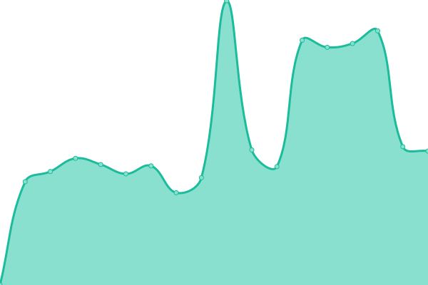

# [📈 Live Status](https://status.crefati.com): <!--live status--> **🟩 All systems operational**

This repository contains the open-source uptime monitor and status page for [Crefati Technologies](https://crefati.com/), powered by [Upptime](https://github.com/upptime/upptime).

With [Upptime](https://upptime.js.org), you can get your own unlimited and free uptime monitor and status page, powered entirely by a GitHub repository. We use [Issues](https://github.com/crefati/monitoring/issues) as incident reports, [Actions](https://github.com/crefati/monitoring/actions) as uptime monitors, and [Pages](https://status.crefati.com) for the status page.

<!--start: status pages-->
<!-- This summary is generated by Upptime (https://github.com/upptime/upptime) -->
<!-- Do not edit this manually, your changes will be overwritten -->
<!-- prettier-ignore -->
| URL | Status | History | Response Time | Uptime |
| --- | ------ | ------- | ------------- | ------ |
|  [Crefati Main Website](https://www.crefati.com) | 🟩 Up | [crefati-main-website.yml](https://github.com/crefati/monitoring/commits/HEAD/history/crefati-main-website.yml) | 

 4281ms
     
 | 

<a href="https://status.crefati.com/history/crefati-main-website">100.00%</a>
    

|  [Crefati Hosting](https://my.crefati.com:2222) | 🟩 Up | [crefati-hosting.yml](https://github.com/crefati/monitoring/commits/HEAD/history/crefati-hosting.yml) | 

 252ms
     
 | 

<a href="https://status.crefati.com/history/crefati-hosting">100.00%</a>
    

|  [Crefati Email Dashboard](https://my.crefati.com/roundcube) | 🟩 Up | [crefati-email-dashboard.yml](https://github.com/crefati/monitoring/commits/HEAD/history/crefati-email-dashboard.yml) | 

 1888ms
     
 | 

<a href="https://status.crefati.com/history/crefati-email-dashboard">100.00%</a>
    

|  [ZRMT Website](https://zrmt.or.tz/) | 🟩 Up | [zrmt-website.yml](https://github.com/crefati/monitoring/commits/HEAD/history/zrmt-website.yml) | 

 3181ms
     
 | 

<a href="https://status.crefati.com/history/zrmt-website">100.00%</a>
    

|  [ROZAC Website](https://royalzanzibar.co.tz/) | 🟩 Up | [rozac-website.yml](https://github.com/crefati/monitoring/commits/HEAD/history/rozac-website.yml) | 

 466ms
     
 | 

<a href="https://status.crefati.com/history/rozac-website">100.00%</a>
    

|  [ROZAC Tourism Website](https://tours.royalzanzibar.co.tz/) | 🟩 Up | [rozac-tourism-website.yml](https://github.com/crefati/monitoring/commits/HEAD/history/rozac-tourism-website.yml) | 

 547ms
     
 | 

<a href="https://status.crefati.com/history/rozac-tourism-website">100.00%</a>
    

|  [Jaomaffl Website](https://jaomaffl.co.tz/) | 🟩 Up | [jaomaffl-website.yml](https://github.com/crefati/monitoring/commits/HEAD/history/jaomaffl-website.yml) | 

 2223ms
     
 | 

<a href="https://status.crefati.com/history/jaomaffl-website">100.00%</a>
    

|  [MyTrip Connector Tourism Website](http://mytripconnector.com/) | 🟩 Up | [my-trip-connector-tourism-website.yml](https://github.com/crefati/monitoring/commits/HEAD/history/my-trip-connector-tourism-website.yml) | 

 180ms
     
 | 

<a href="https://status.crefati.com/history/my-trip-connector-tourism-website">100.00%</a>
    

<!--end: status pages-->

[**Visit our status website →**](https://status.crefati.com)

## 📄 License

- Powered by: [Upptime](https://github.com/upptime/upptime)
- Code: [MIT](./LICENSE) © [Crefati Technologies](https://crefati.com/)
- Data in the `./history` directory: [Open Database License](https://opendatacommons.org/licenses/odbl/1-0/)
